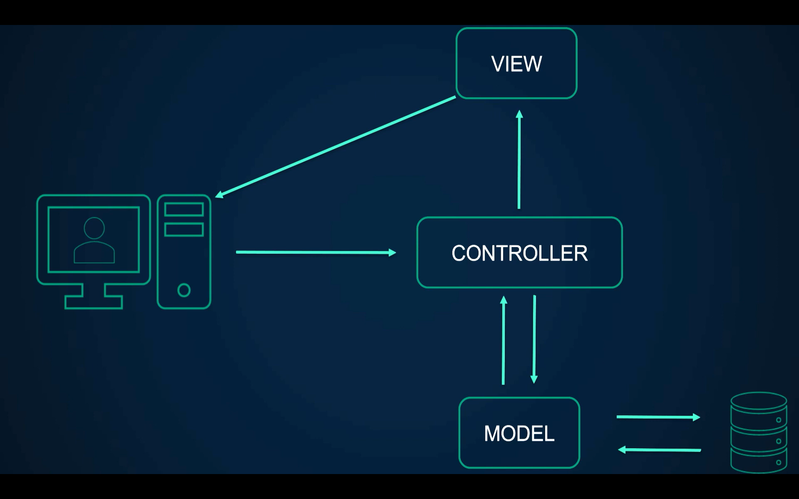
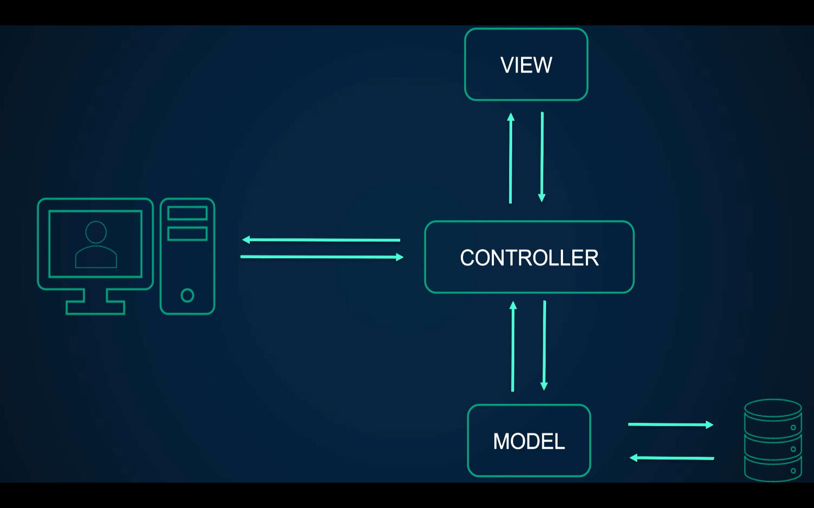
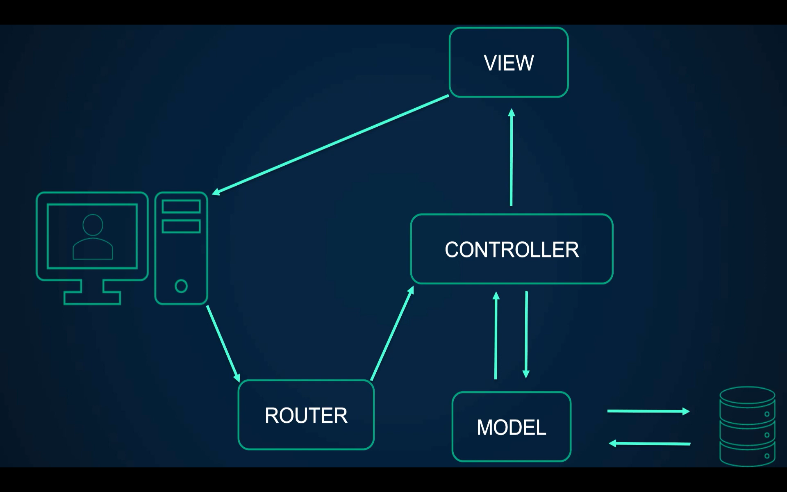
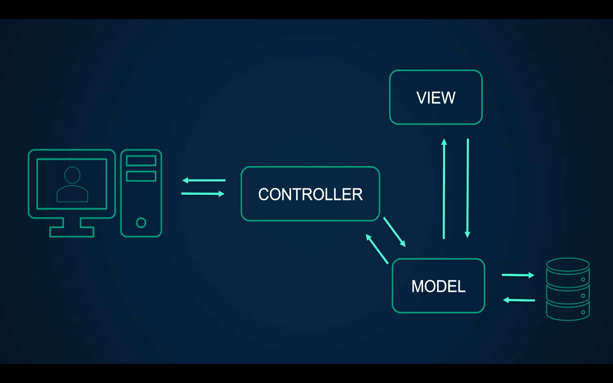
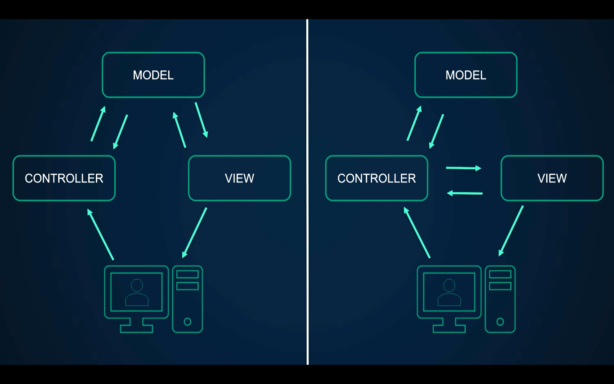

# Варианты реализации MVC-паттерна:

1. Модель взаимодействует с контроллером, но не с уровнем представления (все три схемы описывают одну и ту же реализацию)

2. Модель напрямую взаимодействует с уровнем представления вместо контроллера

Чаще всего используется первый вариант реализации (справа)
